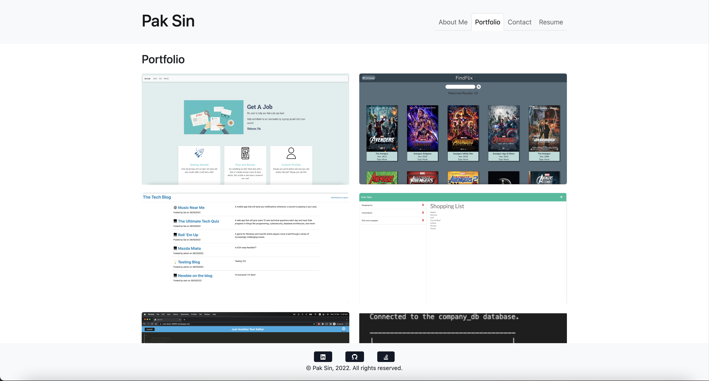

# My Portfolio

## Deployed Link

https://paksin.github.io/20-React-Challenge

## Description

Welcome to my portfolio, where you could discover more about myself as a Full-Stack Developer! Created using React and Bootstrap, the website features Personal and Collaborated Projects, an About Me page, a Contact form with validation, and my Resume. Furthermore, the page implemented responsive design concepts with a minimalistic approach, ensuring a butter-smooth experience from mobile to PC.

## Mock-Up

